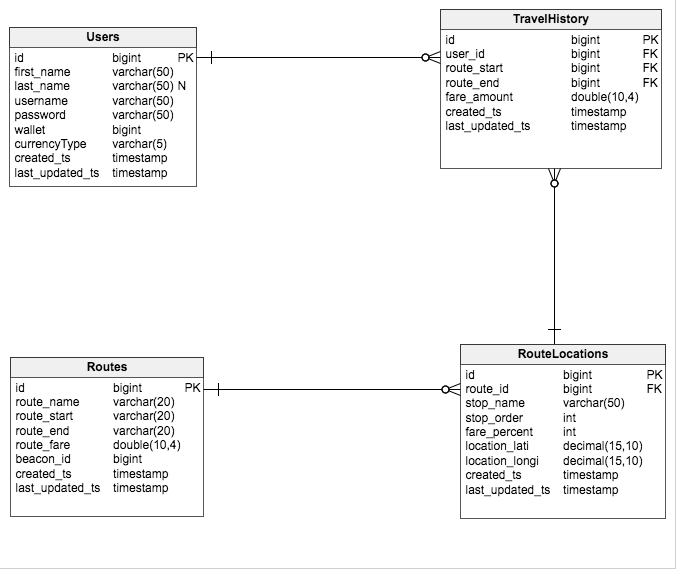
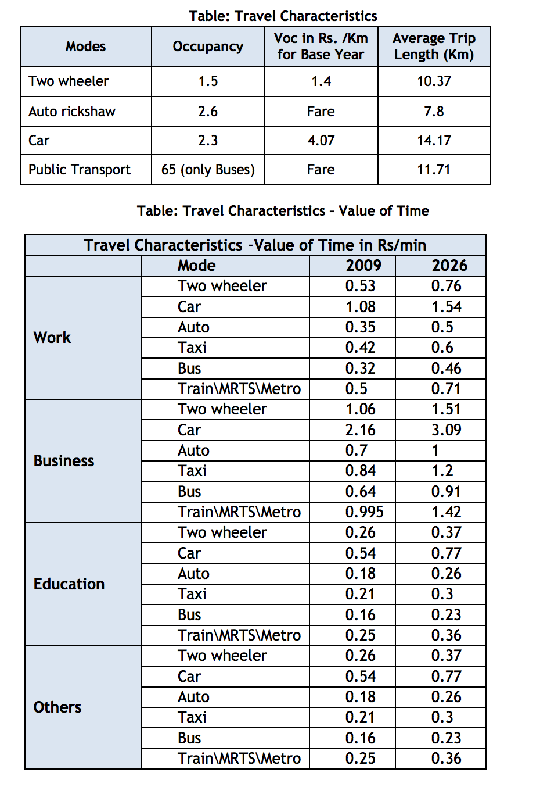

## Introduction:
The term smart starts with being time conscious. One who knows to effectively manage his/her time by managing the tasks is considered to be smart mostly.

### Problem 1:
With that being said, it is often happening in the very real world of transportation, using public transit, that we often wait for a bus that never arrives when it is most needed. I, personally, being the person who often use public transport to get connected with the city I live, I often end up wasting so much time for a bus that never arrives on time. I(still) feel in most of the cases that, “if I had known that this bus won't arrive, I would have taken a cab in order not to miss my appointment”(so does a lot of people).

### Problem 2:
On the other hand, people who board a bus in a crowded crowded city, during a peak time have to go through a lot of trouble to get a ticket(the fewer coins you have for change, the more will be the trouble you go through). Being a smart phone world, pretty much every consumer problem is solvable.

### Two problems and one solution:
With the problems being stated clearly, now it is time to solve them. We propose a system that solves one problem by solving the other. With the proposed system a user who boards the bus can pay the bus fare through his/her mobile application(which has a linked walled system like PayTm) by interacting with the bluetooth beacon that has been attached to the bus he/she is travelling. Thus the user can board the bus, take the mobile out, open the app and get the ticket hassle free, without worrying about the exact change for bus fare, conductor moving through a huge pile of boarded users just to give him/her the ticket.

While this is happening, there can be any set of users who are about to board this bus in the upcoming stop and there can be countable number of busses that travel on the same route. Even though the busses has schedules and order in which they arrive, not in any real world the bus which starts first reaches first due to traffic and the driving skills of the bus driver etc., In this case the user can get to know the minimum waiting time to get the first coming bus in that route. This is done by using the location data of those users who have recently boarded the busses in the route.

### The Flows:
#### BoardMe:
This is the flow in which the user boards a bus and pays through the app.
1. The user board the bus which has a beacon planted to it.
2. User opens the app and clicks board.
3. The system picks the nearest beacon as the reference.
4. The system pick the user location and send the data to the server.
5. The server computes the nearest stop in the route that the beacon belongs to and prompts the following destinations for him/her to choose.
6. The user choose the destination and pays through his app wallet.
7. The user travel history is recorded with the location that the user has boarded.
8. The user also receives a SMS confirmation.
#### BoardWait:
This is the flow in which the user boards a bus and pays through the app.
1. The user opens the app and choses the route he/she wishes to travel.
2. App send the user location and the chosen route to the server.
3. Server finds the stop, closest to the user, in the chosen route and computes the ETA though google API.
4. The app renders the ETA response from the server.

### The architecture:

### The schema:

### The assumptions:
As this is a prototype, it cannot have all the features and satisfy all realistic key factors, hence we bring in a scope that has a limited features and criterions on which this prototype works. Following are the assumptions that are made to define the scope in which the prototype operates(and acts differently from the actually proposed system).
1. As the mobile application is built for android OS, the targeted users are assumed to have smartphones to interact with the system.
2. There is a route in which a bus operates, there can be N such routes and N such buses.
3. Each bus has a beacon attached with it.
4. Each bus is assumed to go only one direction( which is not the case in reality), this is the limitation on this prototype to avoid complications in handling two way routes.
5. Each passenger has an account already in the system and hence no registration is needed from the mobile app.
6. The Bus centre theory: There can be N number of beacons(in the adjacent buses) but the app takes the beacon which is the closest one as the beacon is implanted at the very centre of the bus.(This theory will fail in particular places if there is another bus crossing the bus which the user has boarded. Hence a prompt should be done to chose the route when there are so many beacons)
7. Each of those passengers has a wallet attached to it, which has money loaded to make this prototype work.( In reality the system can have a payment gateway or an attached third party wallet system like PayTm or PayUMoney)

### Tech-stack:
Following are the technologies used in building the prototype.
* Application server: Python 2.6 is used as the backend along with Flask library to built an MVC structure along with Jinja 2 html templating system for html views and exposing endpoints for the mobile application.
* Database: MySQL 5.5 is used to store the user data, route information along with the travel history of the user.(schema above)
* UI Framework: Foundation 6.0.0 CSS for the HTML views.
* Cloud to deploy application: Openshift cloud from Redhat has been used to host the application and it is available with the load balancer. Public URL of the html site : [click here!](http://boardme-dextrous.rhcloud.com/)
* Google Distance Matrix API: The routes and estimated wait time are calculated using the Google API.

### Possible enhancements:
The following are the possible enhancements that can be applied on the system.
1. Maps view: The prototype gives a simple text response from the google API. The user experience can be enhanced by giving a map visualisation of where the bus is from the current location along with the directions to the nearest stop he can reach.
2. Alternate route and split routes: Whenever a user looks for a bus to find the estimated wait time, the system can be made to suggest alternate routes or split routes which , if the user takes, will take comparatively less waiting time than the selected route.
3. The conductor(ticket collector) interface: Even though the proposed system takes away the purpose of having a ticket collector, in our real world, not 100% of the people using public transit use smartphones( in the near future everyone will). There can be another interface for the collector to verify the number of users who are in the bus, at a given point of time.

### People benefited:
The following is the little statistical information that has been gathered as a part of this case study:
* There are around 20% of the Chennai population travel through bus while most of the people travel in buses on the peak hours from 9AM-10AM and 6PM-7PM.
* More than 10,000 commuters use the pass every day.
* The MTC carries 15 lakh passengers more than the BMTC on an average every day deploying only half the number of buses.
* Official figures show that MTC suffers from chronic overcrowding during rush hour as the average occupancy is nearly 100 passengers, when capacity is only 72.
* R. Balasubramanian, a former Managing Director of MTC, says that a promise was made in 2006 to induct 1,000 new buses every year.
* The MTC operates approximately 640 routes with a fleet of about 3300 buses. The fleet strength is depicted in the Figure. During peak hours, the buses operate with more than 100 passengers per bus indicating substantial overcrowding. The MTC covers most of the CMA and even covers up to 50 km beyond the city.

### References:
The following are the references that has been used in the above detailed documentation:
#### Tech:
* Python-Flask-Mysql: http://code.tutsplus.com/tutorials/creating-a-web-app-from-scratch-using-python-flask-and-mysql--cms-22972
* Openshift deployment of Python:  https://github.com/caruccio/openshift-flask-mysql-example
* Material Design in android: http://developer.android.com/design/material/index.html
* Retrofit library of network calls in android:https://github.com/codepath/android_guides/wiki/Consuming-APIs-with-Retrofit
* Estimote beacons:  http://developer.estimote.com/eddystone/ https://github.com/estimote/android-sdk#quick-start-for-eddystone
* Architecture diagram: https://www.draw.io/
* Schema creation: http://www.vertabelo.com
* Twilio: https://www.twilio.com/docs/api  
* GoogleAPIClient for android: https://developers.google.com/android/guides/api-client
#### Statistical:
* Statistical reference on transportation in Chennai: http://www.cmdachennai.gov.in/pdfs/CCTS_Executive_Summary.pdf
* Article in The hindu: http://www.thehindu.com/news/cities/chennai/public-transport-system-chennai-has-miles-to-go/article1143993.ece
* Traffic stat in Chennai: http://chennaicityconnect.com/chennai-pedia/statistics/traffic-transportation/
